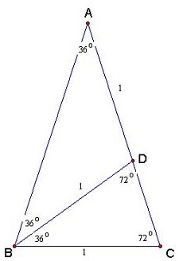

# Calculus (6)

## Pre-calculus (1)
!!! Question "Q: What is $\sin(18^{\circ})$? (Medium)"
    What is $\sin(18^{\circ})$?
??? Done "A: What is $\sin(18^{\circ})$?" 
	The answer is $(\sqrt{5} - 1)/4$. The geometry method is illustrated below (let CD = $x$):
		    
    { align=left }

    \begin{align*}
	\frac{2+x}{2} = \frac{2}{x} \implies x = \sqrt{5} - 1 \implies sin(18^{\circ}) = \frac{1}{2+x} = \frac{\sqrt{5}-1}{4}
	\end{align*}
	
    The algebraic method is:
	
    \begin{align*}
		\theta = 18^{\circ} &\iff 5\theta = 90^{\circ}\\
		\sin(2\theta) &= \cos(3\theta)\\
		2\sin(\theta)\cos(\theta) &= \cos(2\theta)\cos(\theta) - \sin(2\theta)\sin(\theta) \\
        & = \cos(2\theta)\cos(\theta) - 2\sin(\theta)\cos(\theta)\sin(\theta)\\
		2\sin(\theta) &= \cos(2\theta) - 2\sin(\theta)\sin(\theta)\\
		2\sin(\theta) &= 1 - 2\sin^2(\theta) - 2\sin(\theta)\sin(\theta)\\		
	\end{align*}

	and finally,

	\begin{align*}
        4\sin^2(\theta) + 2\sin(\theta) - 1 &= 0\\
		\sin(\theta) = \frac{\sqrt{5} - 1}{4}
	\end{align*}

## Limits (3)
!!! Question "Q: Square Root of 2 (Easy)"
    Calculate $\sqrt{2 + \sqrt{2 + \sqrt{2 + \dots}}}$.
??? Done "A: Square Root of 2 (Easy)" 
    !!! inline "Trick"
        If you are asked for something in a repetitive process such as computing an *"until event"* in coin tossing or a recursive pattern as in this problem, **make it a variable and solve it**.
    
    Let 

    $$
    x \equiv \sqrt{2 + \sqrt{2 + \sqrt{2 + \dots}}}
    $$
    
    Then 
    $$
    x = \sqrt{2 + x}
    $$
    
    So $x = 2$. Note that the other root $x = -1$ doesn't work.
    
&nbsp;&nbsp;&nbsp;&nbsp;&nbsp;

!!! Question "Q: Solve $x^{x^{x^{...}}} = 2$ (Easy)"
    Solve $Solve $x^{x^{x^{...}}} = 2$.
??? Done "A: Solve $x^{x^{x^{...}}} = 2$ (Easy)" 
    !!! inline "Trick"
        If you are asked for something in a repetitive process such as computing an *"until event"* in coin tossing or a recursive pattern as in this problem, **make it a variable and solve it**.
    
    $x^{x^{x^{...}}} = 2$ is equivalent to $x^2 = 2$, so $x = \sqrt{2}$.
    
&nbsp;&nbsp;&nbsp;&nbsp;&nbsp;

!!! Question "Q: Limit (Easy)"
    Calculate

    $$
    \lim_{x \to 0}\left[\frac{a^x + b^x}{2}\right]^{\frac1x}
    $$
??? Done "A: Limit (Easy)" 
    !!! inline "Trick"
        Note that if $g(x)$ is **continuous** and $\lim_{x \to x_0}f(x)$ exists, then we have

        $$
        \lim_{x \to x_0} g(f(x)) = g(\lim_{x \to x_0} f(x))
        $$
    
    Since $g(x) \equiv e^x$ is continuous, so we have
    
    \begin{align*}
    &\lim_{x \to 0}\frac1x \ln \left[\frac{a^x + b^x}{2}\right]\\
    &= \lim_{x \to 0} \frac{2}{a^x + b^x}\frac{a^x\ln a + b^x \ln b}{2} = \frac{\ln ab}{2}
    \end{align*}

    Finally, $\lim_{x \to 0}\left[\frac{a^x + b^x}{2}\right]^{\frac1x} = \sqrt{ab}$.

    
&nbsp;&nbsp;&nbsp;&nbsp;&nbsp;

## Derivatives

## Integration

## Complex Numbers (2)

!!! Question "Q: Is $\sin(1^\circ)$ algebraic?"
    Is $\sin(1^\circ)$ algebraic?
??? Done "A: Is $\sin(1^\circ)$ algebraic?"
    Yes.

&nbsp;&nbsp;&nbsp;&nbsp;&nbsp;

!!! Question "Q: Square Root of $i$ (Easy)"
    What is $\sqrt{i}$?
??? Done "A: Square Root of $i$ (Easy)" 
    !!! inline "Trick"
        When you see $i$, usually start to re-write it in Euler's formula:

        $$
        e^{ix} = \cos(x) + i\sin(x)
        $$
    
    By Euler's formula, we have

    \begin{align*}
    &i^{\frac12} \equiv e^{i (2k\pi + \frac{\pi}{2}) \frac12} \\
    &= \cos\left(k\pi + \frac{\pi}{4}\right) + i \sin\left(k\pi + \frac{\pi}{4}\right)\\
    &= \pm\left(\frac{\sqrt{2}}{2} + i \frac{\sqrt{2}}{2}\right)
    \end{align*}
    
    Another method is to observe that:
    
    $$
    \sqrt{i} \equiv a + bi \implies  i = a^2 + 2abi - b^2
    $$

    and so 

    \begin{align*}
    a^2 - b^2 &= 0\\
    2ab &= 1
    \end{align*}

    which gives us the same results.
&nbsp;&nbsp;&nbsp;&nbsp;&nbsp;

