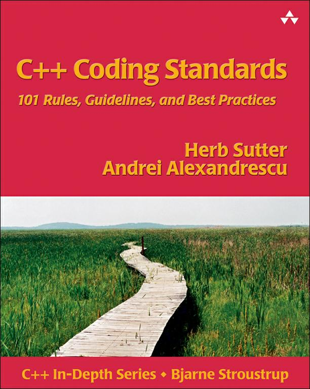
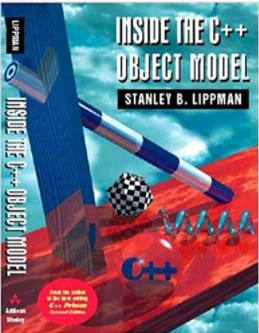

# Index

## Books

<a href="https://stackoverflow.com/questions/388242/the-definitive-c-book-guide-and-list" target="_blank">The Definitive C\+\+ Book Guide and List</a>

<a href="http://www.open-std.org/jtc1/sc22/wg21/docs/papers/2017/n4659.pdf" target="_blank">C\+\+ Standard 2017</a>

<a href="http://www.amazon.com/Clean-Code-Handbook-Software-Craftsmanship/dp/0132350882" target="_blank">Clean Code</a>

<a href="http://www.cppreference.com/" target="_blank">CPP Reference</a>

<a href="http://www.cpp4u.com/" target="_blank">cpp4u</a>

## Tutorials

The major difference between Java and C\+\+ lies in multiple inheritance, which Java has replaced with a simpler concept of interfaces.

The single biggest difference between Java and C/C++ is that Java has a pointer model that eliminates the possibility of overwriting memory and corrupting data.

<a href="http://www.liaoxuefeng.com" target="_blank">Tutorials</a>

<a href="http://cs.lmu.edu/~ray/classes/pl/" target="_blank">Programming Languages</a>

<a href="http://www.amazon.com/Clean-Code-Handbook-Software-Craftsmanship/dp/0132350882" target="_blank">C++ 1</a>, 
<a href="http://www.amazon.com/Programming-Pearls-2nd-Jon-Bentley/dp/0201657880" target="_blank">2</a>
<a href="https://mitpress.mit.edu/sicp/full-text/book/book.html" target="_blank">3</a>

<a href="http://stackoverflow.com/questions/68372/what-is-your-single-most-favorite-command-line-trick-using-bash?page=1&tab=votes#tab-top" target="_blank">Bash tricks 1</a>,
<a href="http://www.quora.com/Computer-Programming/What-are-some-cool-bit-manipulation-tricks-hacks" target="_blank">2</a>,
<a href="http://www.quora.com/Linux/What-are-some-time-saving-tips-that-every-Linux-user-should-know" target="_blank">3</a>

- <a href="https://github.com/imarvinle/interview-1" target="_blank">C/C\+\+面试知识总结</a>
- <a href="https://github.com/CyC2018/CS-Notes" target="_blank">技术面试必备基础知识</a>
- <a href="https://mp.weixin.qq.com/s/7xANFCFUd528Lch3lqcbRg" target="_blank">这可能是东半球最保姆级的后台服务器开发学习路线</a> 
- <a href="https://github.com/microsoft/ai-edu" target="_blank">AI education materials</a>

## Programming
### Programming Languages
  - <a href="http://www.amazon.com/Types-Programming-Languages-Benjamin-Pierce/dp/0262162091" target="_blank">Types and programming languages</a>
  - <a href="http://www.cis.upenn.edu/~bcpierce/sf/current/index.html" target="_blank">Software Foundations</a>

### C
  - The C Programming Language
  - Pointers on C
  - C Traps and Pitfalls
  - Expert C Programming

### C\+\+
  - C\+\+ Primer, Accelerated C\+\+, The C\+\+ Programming Language  
  - C\+\+ Templates
  - Effective C\+\+, More Effective C\+\+, Exceptional C\+\+, More Exceptional C\+\+, Effective STL  
  - C\+\+ Coding Standards, Exceptional C\+\+ Style
  - Inside the C++ Object Model

  <a href="https://stackoverflow.com/questions/388242/the-definitive-c-book-guide-and-list" target="_blank">The Definitive C\+\+ Book Guide and List</a>

  <a href="http://www.open-std.org/jtc1/sc22/wg21/docs/papers/2017/n4659.pdf" target="_blank">C\+\+ Standard 2017</a>

  <a href="http://www.amazon.com/Clean-Code-Handbook-Software-Craftsmanship/dp/0132350882" target="_blank">Clean Code</a>

  <a href="http://www.cppreference.com/" target="_blank">CPP Reference</a>

  <a href="http://www.cpp4u.com/" target="_blank">cpp4u</a>