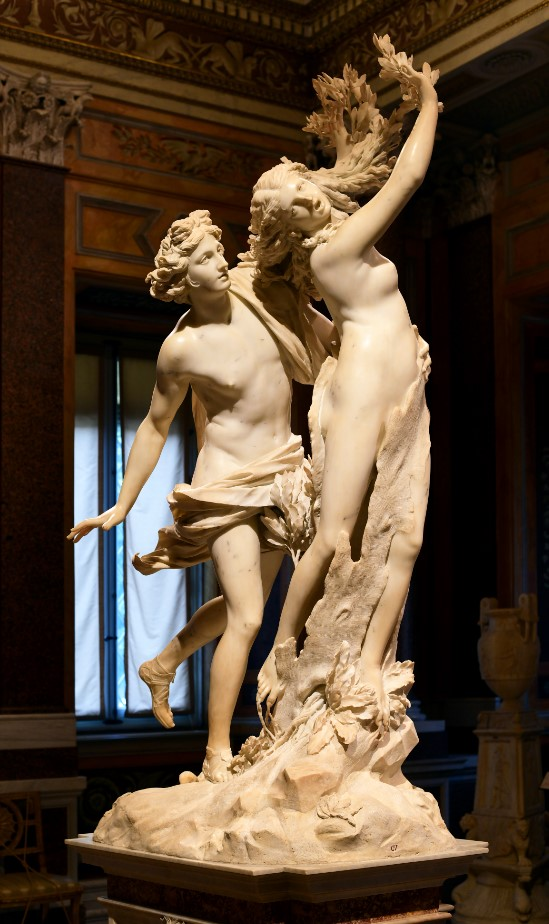

<figure>

  
  <figcaption>Apollo and Daphne by Gian Lorenzo Bernini, circa 1625.</figcaption>

</figure>

# Preface
Apollo, the Greek god of music, poetry, art, the sun, and a great warrior, mocked the god of love, Eros, for his use of bow and arrow, as Apollo is also patron of archery. “What are you doing with powerful weapons, naughty boy?” He said. "That equipment of yours is fitting of our shoulders, which are able to give certain wounds to wild animals, and to enemies, I who recently killed the swollen Python, who was pressing down so many acres with his disease-bearing belly, with countless arrows! You will be content to provoke some loves by your fire, not to lay claim to my honors.” This is the context behind the story.

The insulted Eros then prepared two arrows: one of gold and one of lead. He shot Apollo with the gold arrow, instilling in the god a passionate love for the river nymph Daphne. He shot Daphne with the lead arrow, instilling in her a hatred for Apollo. Having taken after Apollo’s sister, Artemis (Diana), Daphne had spurned her many potential lovers, preferring instead woodland sports and exploring the forest. Due to her identity as an “aemula Phoebes” (female rival or emulator of Artemis), she had dedicated herself to perpetual virginity. Her father, the river god Peneus, demanded that she get married and give him grandchildren. She, however, begged her father to let her remain unmarried; he eventually complied.

Apollo continually followed her, begging her to stay, but the nymph continued to reject him. They were evenly matched in the race until Eros intervened, helping Apollo catch up to Daphne. Seeing that Apollo was bound to reach her, she called upon her father, "Help me, Peneus! Open the earth to enclose me, or change my form, which has brought me into this danger! Let me be free of this man from this moment forward!" And with that, Peneus answered her plea, and “a heavy numbness seizes her limbs; her soft breasts are surrounded by a thin bark, her hair changes into foliage, her arms change into branches; her foot, just now swift, now clings to sluggish roots.” She turned into a laurel tree.

In spite of Daphne's terror and fervent insistence that he leaves her alone, Apollo vowed to honor her forever: “Always my hair will have you, my lyres will have you, my quivers will have you, laurel tree. You will be present for the Latin leaders when a happy voice will sing a triumph and the Capitoline Hill will see long processions.”

Apollo also used his powers of eternal youth and immortality to render Daphne evergreen ("you also, wear always the perpetual honors of your foliage!"). For this reason, the leaves of the Bay laurel tree do not decay.

